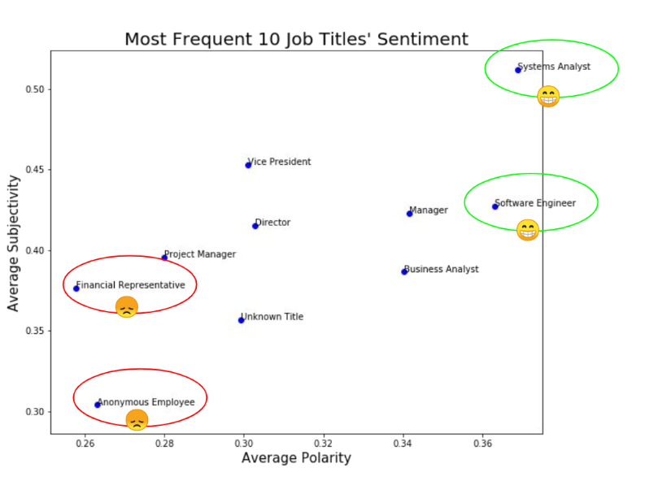
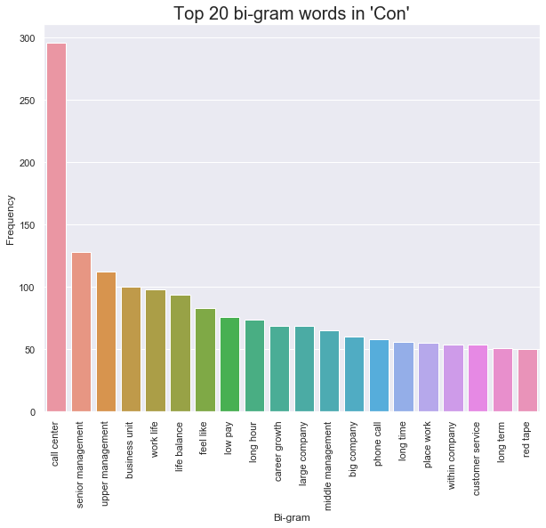

# Glassdoor Company Review Analysis with NLP

This project is a Glassdoor employer review analysis on a large company. The goals are to build a workflow for similar Glassdoor company review tasks and help employers gain insights on their employee engagement. Although the data in this project is about one company, the techniques can be applied to any company that has enough Glassdoor reviews. Specifically, we will find answers to these questions: what employees like and dislike about their company? Has the company’s reputation gotten better or worse over the years? What are the keywords that employees say about this company? What can this company do to improve employee engagement?

## Project Overview
The analysis consists of 3 Jupyter notebooks.
1. Data Cleaning and Exploratory Data Analysis 
2. Sentiment Analysis 
3. Keywords Extraction and Topic Modeling 

Tools used:
Python, Pandas, Regex, NLTK, TextBlob, Gensim, Spacy.

See the <a href="https://github.com/teresanan/glassdoor-company-review-analysis/blob/master/presentation-slides.pdf">presentation slides</a> for a summary of this analysis. 

## Analysis Approaches
#### 1. Data Cleaning and EDA
To gather data for this analysis, I scraped Glassdoor employer reviews after obtaining Glassdoor's written permission.The data requires extensive cleaning and preprocessing because it is unstructured and untidy. I dropped duplicate records, handled missing values and performed feature engineering using Regex to extract data from different columns and different strings. I also explored the data using visualization which gained meaningful insights on this company's engagement. The detailed notebook of this part can be found <a href="https://github.com/teresanan/glassdoor-company-review-analysis/blob/master/notebooks/1-data-cleaning-and-EDA.ipynb">here</a>. To view interactive Plotly figures, please visit <a href="https://teresanan.github.io/">this website</a>.

#### 2. Sentiment Analysis
For sentiment analysis, I used TextBlob to examine the sentiment of all the text columns 'Summary','Pro' and 'Con'. The polarity ranges from -1 to 1, with -1 denotes very negative and +1 denotes very positive. The subjectivity ranges from 0 to 1, with 0 denotes fact and 1 denotes is very much an opinion. The detailed notebook of this part can be found <a href="https://github.com/teresanan/glassdoor-company-review-analysis/blob/master/notebooks/2-sentiment-analysis.ipynb">here</a>.

#### 3. Key Words Extraction and Topic Modeling
Before conducting topic modeling, I visualized the top unigram words using wordcloud and top bigram words using bar chart. Thus we can have a better sense of the key words and estimate the number of total topics. In topic modeling, I used Gensim's LDA model with Bag-of-Words and TF-IDF feature selections. Lastly, I delved into the unhappy group and extracted their comment's keywords using Spacy's rule-based matching. The detailed notebook of this part can be found <a href="https://github.com/teresanan/glassdoor-company-review-analysis/blob/master/notebooks/3-keywords-extraction-and-topic-modeling.ipynb">here</a>.

## Key Findings
#### 1. What employees like and dislike about this company? 
Employees love the good pay, generous benefits, profit sharing and a good work-life balance. Employees from call centers complain about the low pay, long hours handling phone calls and the management team. Project managers complain about the upper management team. Other anonymous employees which could consist of any job family complain about the aforementioned issues plus red tape of large corporations and constant changes.
#### 2. Has the company’s reputation gotten better or worse in the recent year? 
This company did great compared to other companies’ average ratings on Glassdoor. The majority of employees are satisfied with the company. Its rating has been increasing since 2008 with small dips in 2011, 2013 and 2017.
#### 3. Which job families have the highest and lowest satisfaction rates? 
Among the most frequent job titles, Financial Representatives have the lowest satisfaction and Software Engineers & System Analysts give the highest ratings. Since we know the negative comments are from call center employees, our best guess is Financial Representatives work in the call center.

#### 4. What are the keywords that people say about this company? 
The keywords are most clear in the top bi-gram plots. They are: good salary, good benefits, generous profit sharing, big company, work-life balance, upper management, low pay, long hours.
#### 5. What can this company do to improve employee engagement? 
This analysis identified the negative comments are mainly from call center employees. We suggest the company look into the salary, working hours and find solutions to address these issues. If call center employee engagement increases, the total employee engagement will increase significantly.

## Project Contribution
This project has created a reuseable standard workflow for similar tasks. Given any company’s Glassdoor review data, the same structure and code can be applied with little tweaks, especially the data cleaning code blocks can be used without change since all Glassdoor review data follow the same format.

## Limitations & Future Work
Since there are 1578 unhappy employees submitted anonymously, we can’t do a more granular analysis on specific job families. It is our assumption that Financial Representatives work in call centers, if this is untrue, we would need to analyze this further. For future work, we could do a similar analysis on this company's competitor and see how they compare and what they can learn from each other.

## Acknowledgement
I would like to extend my appreciation to Glassdoor for allowing me web scraping the data. A sincere thanks to my Springboard mentor Tommy Blanchard for his guidance. 
